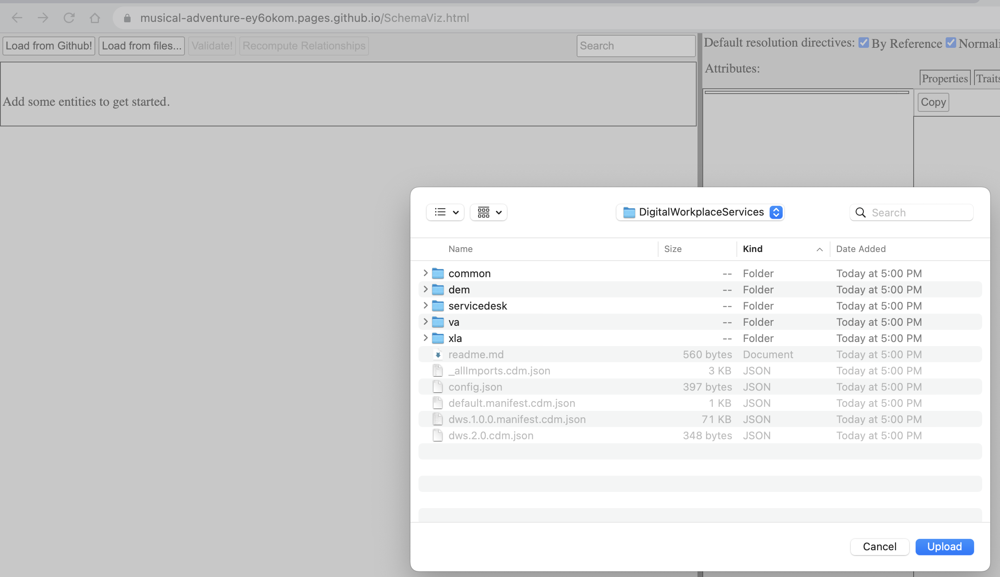
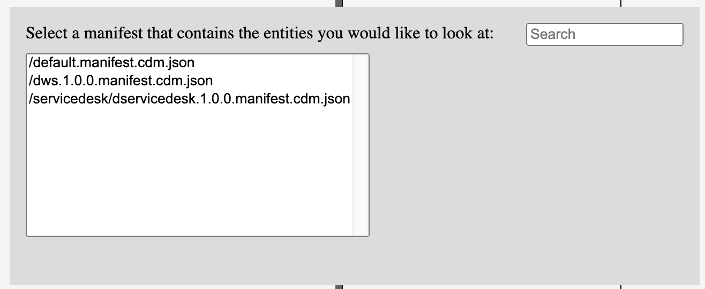
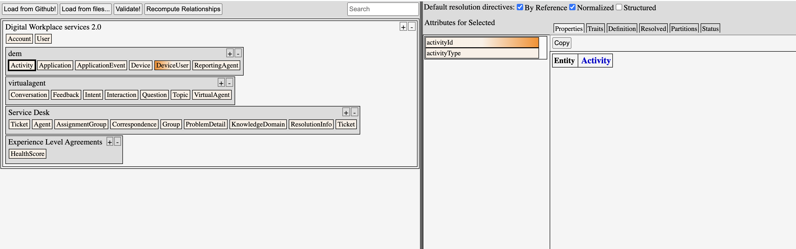

# Welcome to Kyndryl Digital Workplace Services Common Data Model 
DWS Common Data Model is based on Common Data Model (<link>) published by Microsoft. 


# Introduction

The Kyndryl DWS Common Data Model defines a common language to describe business entities accross DWS Solutions. The standard is based on Microsoft's Common Data Model and follows the semantics defined in Microsoft Common Data Model (CDM)

The goal of CDM is to enable data and application interoperability spanning multiple channels, service implementations, and vendors. CDM provides self-describing data (structurally and semantically), enabling applications to easily read and understand the data.

The CDM is undergoing a specification effort driven by Microsoft and the documents published are continuously being iterated upon.

This project has adopted the [Microsoft Open Source Code of Conduct](https://opensource.microsoft.com/codeofconduct/).
For more information see the [Code of Conduct FAQ](https://opensource.microsoft.com/codeofconduct/faq/) or
contact [opencode@microsoft.com](mailto:opencode@microsoft.com) with any additional questions or comments.


## Why

TODO
&nbsp;  
&nbsp;  
    
## What 
**DWS Common Data Model**
DWS Common Data Model defines a meta data system that defines shape, schema andn traits of data (Entities, Attributes, Relations, and Traits); So that Applications and systems with DWS have common data schema. 

-	Enables data standardization among application and offerings that are built using Microsoft Power Platform


&nbsp;  
**Common Data Model (CDM) Schema**

The Common Data Model is a declarative specification, and definition of standard entities that represent commonly used concepts and activities across business and productivity applications, and is being extended to observational and analytical data as well. CDM provides well-defined, modular, and extensible business entities such as Account, Business Unit, Case, Contact, Lead, Opportunity, and Product, as well as interactions with vendors, workers, and customers, such as activities and service level agreements. Anyone can build on and extend CDM definitions to capture additional business-specific ideas.


&nbsp;  
&nbsp;  
## How

There are two ways to consume the information in this repository:


1. <a href= "https://musical-adventure-ey6okom.pages.github.io/SchemaViz.html" target="_new">DWS CDM Schema Explorer</a>
2. <a href="https://musical-adventure-ey6okom.pages.github.io/" target="_new">DWS CDM Visual Entity Navigator</a> for interactively exploring entities, entity extensions/inheritance, attributes, and relationships

Schema definitins described here are based on the below DWS solution contexts.

| sl#                       | DWS Solution Area         | link |
| :---                      |     :---                          |          :--- |
| 1                         | Virtual Agent Platform            | [ Context ](docs/weber/va/va.html)    |
| 2                         | Service Desk Analytics            | git status    |
| 3                         | Digital Experience Monitoring     | git status    |
| 4                         | Catalog of XLAs                   | git status    |


**Note1: Using Entity Navigator from Private/Internal Repository**
If hosted on public repos, the Entity Navigator can fetch the manifest directly. When it is hosted on internal/private repository, follow below step to navigate Entities.

- Step 1 :  **clone githib repo.** for ex. below clones testpilot repo from 'kyndryl-dws-oc' Org.

    ```
    https://github.com/kyndryl-dws-oc/testpilot.git
    ```

    From the clonned folder, Find the the directories /schemaDocuments/DigitalWorkplaceServices

- Step 2 : **Select Manifest**
    When you Open the Entity Navigator ( abover #2 link), click "Load from Files"
    

    select **DigitalWorkplaceServices**; and select the manifest of your interest( defalut for ex.)
    

- Step 3 : **Explore Entities**
    


&nbsp;  
&nbsp;  
# Documentation for Integrators / Developers
TODO.  
Please refer to Microsoft CDM(Referred Below) for details.

## Reference to Microsoft Common Data Model

Refer [Microsoft Common Data Model](https://github.com/microsoft/CDM) Git hub Repository for more details.


&nbsp;  
&nbsp;  
<hr/>

# Legal Notices

Microsoft and any contributors grant you a license to the Microsoft documentation and other content
in this repository under the [Creative Commons Attribution 4.0 International Public License](https://creativecommons.org/licenses/by/4.0/legalcode),
see the [LICENSE](LICENSE) file, and grant you a license to any code in the repository under the [MIT License](https://opensource.org/licenses/MIT), see the
[LICENSE-CODE](LICENSE-CODE) file.

Microsoft, Windows, Microsoft Azure and/or other Microsoft products and services referenced in the documentation
may be either trademarks or registered trademarks of Microsoft in the United States and/or other countries.
The licenses for this project do not grant you rights to use any Microsoft names, logos, or trademarks.
Microsoft's general trademark guidelines can be found at http://go.microsoft.com/fwlink/?LinkID=254653.

Privacy information can be found at https://privacy.microsoft.com/en-us/

Microsoft and any contributors reserve all others rights, whether under their respective copyrights, patents,
or trademarks, whether by implication, estoppel or otherwise.
